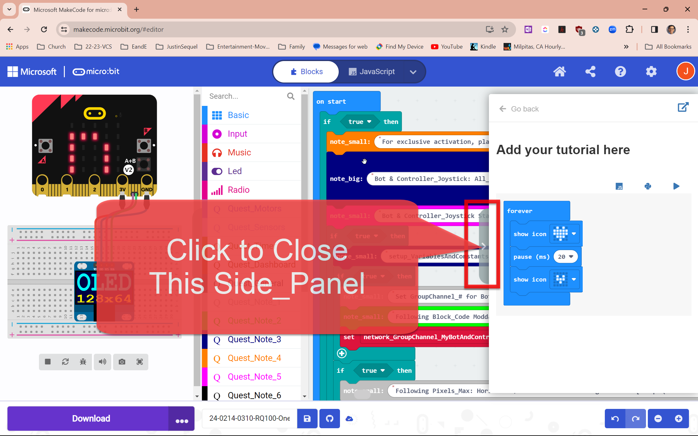

<!---   --->
<!--- add suffix '?raw=true' --->

# Side_Panel Guide: 


<!--- Need following dummy blank line above for this upcoming divider_line to work --->

--- 

# * A. Modding Basic Code: Bright_Green Comment Blocks Mark the Following Block_Code as Moddable

 


<!--- Need following dummy blank line above for this upcoming divider_line to work --->

---

# * Quick-Start to Flash/Download Code to 'micro:bit' USB-Cable-Connected w/ Computer
# ** One-Time Setup: Chrome Browser


# ** 


# ** 


# ** 


# ** 


# ** How to Read the Group-Channel-# (Bot_Id) on your LED-Screen for both Both and Controller_Joystick


<!--- Need following dummy blank line above for this upcoming divider_line to work --->

---

# [* Staff Reference Prezi-Map: RQ100 ~ R&D-Tutorial_07: Lesson_01A: EasyToCode, SlowToDrive (WebLink)](https://jasonc1025-333.github.io/24-0214-0310-rq100-onecode-bot_controller-beginner-final/)

# THE END
# 
# 
# EXTRAS

# Open Below: [R100: Lesson 2D: JoyRide: Download/Flash Code (Ver2.1+) & Quick-Start / Troubleshoot Guide](https://prezi.com/view/FAS9L5Lf4o6THzCeSVEs/)


---

[](https://youtu.be/vt5fpE0bzSY)

[](https://youtu.be/T-D1KVIuvjA)

[](https://www.youtube.com/watch?v=_5tFXJQIzi4)

Mixture Variants:
https://user-images.githubusercontent.com/6877923/115474571-03c75800-a23e-11eb-8096-8973aad5fa9f.mp4

Earth Heightmap node:
https://user-images.githubusercontent.com/6877923/123006036-64e2e780-d3b7-11eb-922e-018994b32da5.mov


<!--- add suffix '?raw=true' --->
<!--- jwc n  --->


24-0702-0630

Y B100 Video:
https://drive.google.com/file/d/1KJumywfV1-d1zkXxHNkKA9eEUC-9-BP9/view?usp=sharing

? B100 Video-GIF: NEED EXT GIF VIEWER
https://drive.google.com/file/d/1ZwvWgVwbhkRiV728-W117L56DvE0GhHL/view?usp=sharing

N Gif Test 3


24-0702-0450


24-0702-0650
<video src='https://drive.google.com/file/d/1KJumywfV1-d1zkXxHNkKA9eEUC-9-BP9/view?usp=sharing' width=180/>

24-0702-0700
[](https://raw.githubusercontent.com/jasonc1025-333/24-0214-0310-rq100-onecode-bot_controller-beginner-final/blob/master/RQ-MerryGoRound-WhackAMole-ArenaAndBotCams-Final-2020-0617-0945-AddTitle.mp4)
24-0702-0701
[![Watch the video]](https://raw.githubusercontent.com/jasonc1025-333/24-0214-0310-rq100-onecode-bot_controller-beginner-final/blob/master/RQ-MerryGoRound-WhackAMole-ArenaAndBotCams-Final-2020-0617-0945-AddTitle.mp4)
24-0702-0702
[![Watch the video]](https://github.com/jasonc1025-333/24-0214-0310-rq100-onecode-bot_controller-beginner-final/blob/master/RQ-MerryGoRound-WhackAMole-ArenaAndBotCams-Final-2020-0617-0945-AddTitle.mp4)

Y 24-0702-0710 8MB 380x180 GIF: 


# NOT WORK: BEGIN


[](https://github.com/jasonc1025-333/24-0214-0310-rq100-onecode-bot_controller-beginner-final/blob/master/RQ-MerryGoRound-WhackAMole-ArenaAndBotCams-Final-2020-0617-0945-AddTitle.mp4)
# NOT WORK: END

# Header
## Sub_Header
### Sub_Sub_Header

## Add your tutorial here

``` blocks
basic.forever(function () {
    basic.showIcon(IconNames.Heart)
    basic.pause(20)
    basic.showIcon(IconNames.SmallHeart)
})
if (true) {
    quest_Note_4.quest_Show_String_For_Note_Small_Func(
    "For exclusive activation, place this 'on start' stack higher than other 'on start' stacks"
    )
    quest_Note_3.quest_Show_String_For_Note_Big_Func(
    "Bot & Controller_Joystick: All_in_One Code"
    )
    quest_Note_5.quest_Show_String_For_Note_Small_Func(
    "Bot & Controller_Joystick Stack: 'on start'"
    )
    if (true) {
        quest_Note_3.quest_Show_String_For_Note_Small_Func(
        "setup_VariablesAndConstants_UserCustomizable: Yes"
        )
        if (true) {
            quest_Note_1.quest_Show_String_For_Note_Small_Func(
            "Set GroupChannel_# for Both Bot & Controller_Joystick: Default = 1"
            )
            quest_Note_2.quest_Show_String_For_Note_Small_Func(
            "Following Block_Code Moddable"
            )
            network_GroupChannel_MyBotAndController_Base0_Int = 1
        }
        if (true) {
            quest_Note_1.quest_Show_String_For_Note_Small_Func(
            "Following Pixels_Max: Horizontal/Vertical: 512 -&- Diagonal: 887 [= sqrt(512^2 + 512^2)]"
            )
            quest_Note_1.quest_Show_String_For_Note_Small_Func(
            "Was 15, try 30 to accomodate off_calibrated controllers"
            )
            quest_Note_2.quest_Show_String_For_Note_Small_Func(
            "Following Block_Code Moddable"
            )
            controller_Joystick__Polar_OriginAtCenter__Directional_MagnitudePixel__Deadzone_OutOf_512Pixels_AsIdle__INT = 30
        }
        if (true) {
            quest_Note_1.quest_Show_String_For_Note_Small_Func(
            "Following Gears are not used in Level_1 but need these null declarations... "
            )
            quest_Note_1.quest_Show_String_For_Note_Small_Func(
            "...to allow Level_2 code to compile (though unused in Level_1)"
            )
            // jwc needed to fix compiler issue
            motor_Power_Gear_01_MAX = 0
            // jwc needed to fix compiler issue
            motor_Power_Gear_02_MAX = 0
        }
    }
    if (true) {
        setup_VariablesAndConstants_UserCustomizableNot_Func()
        setup_Network_Func()
        setup_BotAndController_Func()
    }
    quest_Note_6.quest_Show_String_For_Note_Big_Func(
    "Level 1: Variables_n_Constants_Not (Hardcode)"
    )
}

```


<!-- SEEMS NOT NEEDED <script src="https://github.com/jasonc1025-333/24-0214-0310-rq100-onecode-bot_controller-beginner-final/blob/master/24-0325-2140-Makecode-ClickToCloseSidePanel-2024-03-25_21-40-43.png"></script> -->
### .
### .

<!-- SEEMS NOT NEEDED: <script src="https://github.com/jasonc1025-333/24-0214-0310-rq100-onecode-bot_controller-beginner-final/blob/master/Rq100-EducatorResourceGuide-Lesson_2D-JoyRide-NonPreFlashed-FrontScreen-2024-04-26_08-22-12.png"></script> -->

<!--- jwc o 

> Open this page at [https://jasonc1025-333.github.io/24-0214-0310-rq100-onecode-bot_controller-beginner-final/](https://jasonc1025-333.github.io/24-0214-0310-rq100-onecode-bot_controller-beginner-final/)

## Use as Extension

This repository can be added as an **extension** in MakeCode.

* open [https://makecode.microbit.org/](https://makecode.microbit.org/)
* click on **New Project**
* click on **Extensions** under the gearwheel menu
* search for **https://github.com/jasonc1025-333/24-0214-0310-rq100-onecode-bot_controller-beginner-final** and import

## Edit this project

To edit this repository in MakeCode.

* open [https://makecode.microbit.org/](https://makecode.microbit.org/)
* click on **Import** then click on **Import URL**
* paste **https://github.com/jasonc1025-333/24-0214-0310-rq100-onecode-bot_controller-beginner-final** and click import

#### Metadata (used for search, rendering)

* for PXT/microbit
<script src="https://makecode.com/gh-pages-embed.js"></script><script>makeCodeRender("{{ site.makecode.home_url }}", "{{ site.github.owner_name }}/{{ site.github.repository_name }}");</script>

--->

# BROKEN


